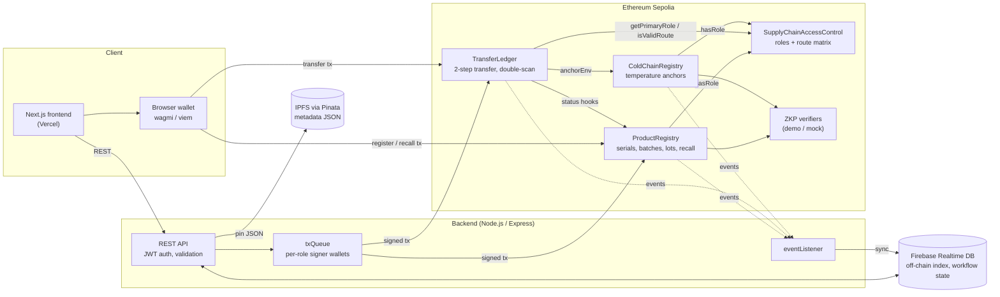

# VaxiTrust — Vaccine Traceability on Blockchain

**🏆 Top 10 – Incubation Track, [Competition name, year]**

[](https://github.com/thienanpham160806-code/vaccine-traceability-blockchain/actions/workflows/ci.yml)

VaxiTrust tracks vaccines from manufacturer or importer through distributors
to clinics and pharmacies. Every hand-over is a two-step, role-checked
transfer on Ethereum. Recalls apply to a whole batch in one transaction, and
anyone can scan a QR code to check whether a vial is genuine, recalled or
already dispensed.

- **Context:** group course project for the Blockchain course at the
  University of Economics and Law (UEL), VNU-HCM.
- **Live demo:** https://vaccine-traceability-blockchain.vercel.app
  (frontend; contracts on Ethereum Sepolia, addresses in
  [`smart-contract/deployments/sepolia.json`](smart-contract/deployments/sepolia.json))

## Architecture



Only hashes go on-chain (serial, batch, metadata, location, document
commitments). Readable product data lives in IPFS and Firebase, and the chain
serves as the tamper-evident record those hashes are checked against.

## Quality metrics

All numbers below come from running the tools on this repository; the
commands are listed under each table. CI
([`.github/workflows/ci.yml`](.github/workflows/ci.yml)) compiles and tests the
contracts, runs coverage, and builds and tests the backend and frontend on
every push and pull request.

### Test coverage

`solidity-coverage` 0.8.17, 146 Hardhat tests (88 before this pass).

| Contract | Statements | Branches | Functions | Lines |
|---|---|---|---|---|
| SupplyChainAccessControl | 100% | 100% (was 80.36%) | 100% | 100% |
| ProductRegistry | 100% (was 71.62%) | 99.56% (was 49.12%) | 100% (was 83.33%) | 100% (was 70.88%) |
| TransferLedger | 100% (was 83.08%) | 94.29% (was 55.71%) | 100% (was 84.62%) | 100% (was 83.78%) |
| ColdChainRegistry | 100% | 100% (was 81.25%) | 100% | 100% |
| **All contracts** | **100%** (was 79.18%) | **98.70%** (was 57.55%) | **100%** (was 86.96%) | **100%** (was 78.88%) |

The 5 uncovered branches cannot be reached through the deployed wiring:
`TransferLedger` re-checks `FLAGGED` / `IN_TRANSIT` after guards that already
exclude them (4 branches), and `ProductRegistry._isRecalled` tests a stored
`RECALLED` status that is never written, because recall is computed from the
batch flag (1 branch).

New suites cover the paths that matter most: role revoke and primary-role
switch, every rejection in the two-step transfer, `rejectTransfer`,
double-scan detection (window and location rules), recall while a transfer is
in flight, flag/unflag, and the ZK import registration path.

```bash
cd smart-contract && npm run coverage
```

### Gas

`hardhat-gas-reporter` 2.3.0 on the Hardhat network; solc 0.8.28, `viaIR`,
optimizer `runs: 1`. Values are gas units; cost in ETH = gas × gas price.

| Function | Min | Max | Avg | Notes |
|---|---|---|---|---|
| `ProductRegistry.registerProduct` | 235,066 | 272,780 | 249,525 | Benchmark: 252,154 for the first serial of a batch, 235,054 for the next. Max is the importer path, which also stores `importDocHash` |
| `TransferLedger.createTransferRequest` | 276,409 | 313,285 | 298,621 | First hop writes fresh `lastScans` slots |
| `TransferLedger.confirmTransfer` | 266,403 | 283,503 | 280,394 | Appends a `TransferRecord`, clears the pending entry |
| `TransferLedger.rejectTransfer` | 70,321 | 70,331 | 70,325 | |
| `ProductRegistry.recallBatch` | – | – | 79,846 | Same cost for any batch size (below) |
| `ProductRegistry.commissionLot` | 149,342 | 149,390 | 149,377 | Registers a whole lot as one Merkle root |

**`recallBatch` is O(1) in batch size.** It sets one flag
(`recalledBatches[batchHash]`) and stores the reason; it does not loop over
serials. Every read (`getStatus`, `getProduct`, `getRiskLevel`) checks that
flag, so each serial in the batch reads as `RECALLED` straight away. Measured
with [`scripts/gas-benchmark.ts`](smart-contract/scripts/gas-benchmark.ts):

| Batch size | `recallBatch` gasUsed | `getBatchSerials` (`eth_call` gas) |
|---|---|---|
| 1 | 79,846 | 27,553 |
| 10 | 79,846 | 47,993 |
| 100 | 79,846 | 252,465 |
| 500 | 79,834 | 1,162,750 |

The part that grows with batch size is the read-only `getBatchSerials`, at
about 2,275 gas per serial. Nothing calls it on-chain, so it cannot block a
recall. An RPC node with geth's default 50M `eth_call` gas cap could return
about 21,900 serials in one call (extrapolated from the slope above, not
measured); larger batches would need paging.

```bash
cd smart-contract && npm run test:gas        # per-method table
cd smart-contract && npm run gas:benchmark   # lifecycle + batch-size scaling
```

### Security (Slither + manual review)

Slither 0.11.6, 102 detectors. Full write-up:
[`docs/security-review.md`](docs/security-review.md).

| | High | Medium | Low | Info | Optimization |
|---|---|---|---|---|---|
| Slither results (37) | 0 | 4 (all false positives) | 23 (22 false positives, 1 accepted) | 5 (style) | 5 (valid, measured, not applied) |
| Manual review (11) | 1 | 2 | 4 | 4 | – |

- **Fixed in a separate PR** (`fix/contract-access-control`, with regression
  tests): **H-1** the TransferLedger lot functions had no caller check, so any
  address could mark any vial as dispensed; **M-1** a recalled lot could still
  be dispensed through a sub-lot; **M-2** revoking a role via OpenZeppelin's
  `revokeRole` / `renounceRole` left the account able to transfer. The live
  Sepolia contracts need a redeploy to pick these up.
- The Slither Medium results (`reentrancy-no-eth`, `incorrect-equality`) are
  false positives: the only external callee is the project's own
  `ProductRegistry`, which makes no callbacks, and the equality compares
  `bytes32` hashes.

## Team & roles

<!-- Fill in one row per member. -->

| Member | Role | Main contributions | GitHub |
|---|---|---|---|
|  |  |  |  |
|  |  |  |  |
|  |  |  |  |
|  |  |  |  |
|  |  |  |  |

## Project structure

```text
smart-contract/   Solidity contracts, Hardhat tests, deployment and gas scripts
backend/          Express API, tx queue, event listener, Firebase/IPFS integration
frontend/         Next.js dashboard and consumer verification UI
docs/             Technical documentation, security review, team handoff notes
```

## Team setup

Read the full handoff before running the project:
[`docs/frontend-backend-handoff.md`](docs/frontend-backend-handoff.md).

Quick run summary:

1. Start local Hardhat node in `smart-contract/`.
2. Deploy contracts and copy printed contract addresses into `backend/.env`.
3. Paste Firebase and Pinata secrets shared by the team lead into `backend/.env`.
4. Start backend on `http://localhost:5000`.
5. Start frontend on `http://localhost:3000`.

Validation commands:

```bash
cd smart-contract && npm test && npm run coverage
cd backend && npm run build && npm test
cd frontend && npm run build
```

## Main Components

### 1. Smart Contract Layer

Located in:

```text
smart-contract/
```

Core contracts:

```text
SupplyChainAccessControl.sol
ProductRegistry.sol
TransferLedger.sol
```

Main responsibilities:

- Manage supply chain roles
- Validate transfer routes
- Register vaccine serials
- Store product status and ownership
- Track batch and recall state
- Support two-step transfer flow
- Detect double-scan risk
- Provide on-chain verification data

### 2. Frontend Layer

Located in:

```text
frontend/
```

Main routes:

```text
/
 /login
/dashboard
/dashboard/products
/dashboard/batches
/dashboard/scan-transfer
/dashboard/verify/[serialId]
/dashboard/risk-dispute
/dashboard/recall
/consumer/verify/[serialId]
```

The frontend runs on:

```text
http://localhost:3000
```

### 3. Backend Layer

Located in:

```text
backend/
```

The backend API is expected to run on:

```text
http://localhost:3001
```

The backend will connect the frontend with:

- Smart contracts
- Database
- IPFS storage
- Authentication
- Business validation logic

## Tech Stack

### Smart Contract

- Solidity
- Hardhat
- TypeScript
- Ethers.js
- OpenZeppelin
- Sepolia Testnet

### Frontend

- Next.js
- TypeScript
- Tailwind CSS
- Shadcn UI / Radix UI
- Mock data during MVP phase

### Backend

- Node.js / TypeScript
- NestJS or Express
- PostgreSQL / Prisma
- IPFS integration
- REST API

## Smart Contract Flow

### Flow 1: Product Registration

Actor:

```text
Manufacturer / Importer
```

Smart contract function:

```text
ProductRegistry.registerProduct()
```

Main checks:

- Caller must have `MANUFACTURER_ROLE` or `IMPORTER_ROLE`
- Serial must not already exist
- Batch must not be recalled
- Importer must provide import document hash and mock ZKP proof
- Product status becomes `VERIFIED`

Stored on-chain:

- serialID
- batchHash
- metadataHash
- importDocHash
- origin
- currentOwner
- status
- imported state
- ZKP verification state

### Flow 2: Transfer and Receive

The transfer flow is a two-step process.

#### Step 1: Create Transfer Request

Smart contract function:

```text
TransferLedger.createTransferRequest()
```

Main checks:

- Product exists
- Sender is current owner
- Sender role can initiate transfer
- Receiver role can receive transfer
- Route is valid
- Product is not `FLAGGED` or `RECALLED`
- There is no active pending transfer
- No double-scan anomaly is detected

Effect:

```text
Product status becomes IN_TRANSIT
Frontend displays PENDING_DELIVERY
```

#### Step 2: Confirm Transfer

Smart contract function:

```text
TransferLedger.confirmTransfer()
```

Main checks:

- Pending transfer exists
- Caller is the intended receiver
- Receiver location is correct
- Product is still valid

Effect:

```text
Product owner changes to receiver
Product status becomes DELIVERED
Transfer history is recorded
```

### Flow 3: Product Verification

Smart contract functions:

```text
ProductRegistry.getProduct()
ProductRegistry.getStatus()
ProductRegistry.getCurrentOwner()
ProductRegistry.getRiskLevel()
ProductRegistry.getFlagReason()
ProductRegistry.isImportedProduct()
ProductRegistry.isZkpVerified()
TransferLedger.getTransferHistory()
```

Frontend routes:

```text
/dashboard/verify/[serialId]
/consumer/verify/[serialId]
```

The dashboard verification page should show full internal verification data.

The consumer verification page should show simplified product status and warnings.

### Flow 4: Batch Recall

Smart contract function:

```text
ProductRegistry.recallBatch()
```

Main effects:

- Batch is marked as recalled
- All serials in the batch become `RECALLED`
- Risk level becomes `CRITICAL`
- Recall reason is stored as `reasonHash`

Supporting functions:

```text
ProductRegistry.getBatchSize()
ProductRegistry.getBatchSerials()
ProductRegistry.isBatchRecalled()
ProductRegistry.getBatchSummary()
```

## Status Mapping

| On-chain Status | Frontend Display |
|---|---|
| REGISTERED | REGISTERED |
| VERIFIED | VERIFIED |
| IN_TRANSIT | PENDING_DELIVERY |
| DELIVERED | DELIVERED |
| FLAGGED | HIGH RISK / FLAGGED |
| RECALLED | RECALLED |

## Role System

| Role | Meaning |
|---|---|
| DEFAULT_ADMIN_ROLE | System admin |
| MANUFACTURER_ROLE | Vaccine manufacturer |
| IMPORTER_ROLE | Vaccine importer |
| DISTRIBUTOR_ROLE | Distributor or intermediate warehouse |
| CLINIC_ROLE | Clinic or vaccination point |
| PHARMACY_ROLE | Pharmacy |
| AUDITOR_ROLE | Auditor / dispute reviewer |
| RECALL_AUTHORITY_ROLE | Authority allowed to recall batches |

## MVP Route Matrix

| From Role | To Role |
|---|---|
| MANUFACTURER_ROLE | IMPORTER_ROLE |
| MANUFACTURER_ROLE | DISTRIBUTOR_ROLE |
| IMPORTER_ROLE | DISTRIBUTOR_ROLE |
| DISTRIBUTOR_ROLE | DISTRIBUTOR_ROLE |
| DISTRIBUTOR_ROLE | CLINIC_ROLE |
| DISTRIBUTOR_ROLE | PHARMACY_ROLE |

Notes:

- `DISTRIBUTOR_ROLE -> DISTRIBUTOR_ROLE` supports intermediate warehouse flow.
- `CLINIC_ROLE` and `PHARMACY_ROLE` cannot initiate physical transfer in the MVP.
- `AUDITOR_ROLE` and `RECALL_AUTHORITY_ROLE` are not part of the physical transfer route.

## How to Run Smart Contract Tests

```bash
cd smart-contract
npm install
npm run compile
npm run test
```

Expected result:

```text
All tests passing
```

Current test coverage includes:

- Product registration
- Importer mock ZKP proof
- Duplicate serial rejection
- Batch recall
- Recall status checks
- Role and route validation
- Two-step transfer
- Transfer confirmation
- Transfer history
- Double-scan detection logic

## How to Run Frontend

```bash
cd frontend
npm install
npm run dev
```

Open:

```text
http://localhost:3000
```

Check routes:

```text
http://localhost:3000
http://localhost:3000/login
http://localhost:3000/dashboard
http://localhost:3000/dashboard/batches
http://localhost:3000/dashboard/products
http://localhost:3000/dashboard/scan-transfer
http://localhost:3000/dashboard/verify/VCN-2026-000001
http://localhost:3000/dashboard/risk-dispute
http://localhost:3000/dashboard/recall
http://localhost:3000/consumer/verify/VCN-2026-000001
```

Build check:

```bash
npm run build
```

## Environment Variables

### Smart Contract

Create:

```text
smart-contract/.env
```

Based on:

```text
smart-contract/.env.example
```

Required variables:

```env
SEPOLIA_RPC_URL=
PRIVATE_KEY=
ETHERSCAN_API_KEY=
```

Important:

```text
Never commit .env
Never use a wallet that contains real funds
Use a test wallet for Sepolia deployment
```

### Frontend

Create:

```text
frontend/.env.local
```

Based on:

```text
frontend/.env.local.example
```

Example:

```env
NEXT_PUBLIC_API_BASE_URL=http://localhost:3001
NEXT_PUBLIC_APP_NAME=Vaccine Traceability
```

Notes:

- Frontend runs at `http://localhost:3000`
- Backend API is expected to run at `http://localhost:3001`

## Deployment

### Local Deployment

```bash
cd smart-contract
npm run deploy:local
```

The deployment script should:

1. Deploy `SupplyChainAccessControl`
2. Deploy `ProductRegistry`
3. Deploy `TransferLedger`
4. Link `TransferLedger` to `ProductRegistry`
5. Configure MVP routes

### Sepolia Deployment

```bash
cd smart-contract
npm run deploy:sepolia
```

Deployment outputs are saved in:

```text
smart-contract/deployments/
```

Sepolia deployment address file:

```text
smart-contract/deployments/sepolia.json
```

## Backend API Mapping

| Frontend Action | Backend Endpoint | Smart Contract Function |
|---|---|---|
| Register product | POST /products/register | ProductRegistry.registerProduct |
| Create transfer request | POST /transfers/scan | TransferLedger.createTransferRequest |
| Confirm transfer | POST /transfers/confirm | TransferLedger.confirmTransfer |
| Verify product | GET /verify/:serialId | ProductRegistry + TransferLedger |
| Consumer verify | GET /consumer/verify/:serialId | ProductRegistry + TransferLedger |
| Recall batch | POST /recalls | ProductRegistry.recallBatch |
| Risk alerts | GET /risk/alerts | ProductRegistry risk fields |

## Frontend Alignment Notes

The frontend should align with the current smart contract flow.

### Product Page

Route:

```text
/dashboard/products
```

Must support:

- Register product
- Show product status
- Show QR result
- Distinguish local and imported products

### Batch Page

Route:

```text
/dashboard/batches
```

Must show:

- Batch ID / batch hash
- Batch size
- Recall status
- Product serial list
- Recall action if authorized

### Scan Transfer Page

Route:

```text
/dashboard/scan-transfer
```

Must have two sections:

1. Create Transfer Request
2. Confirm Transfer

The page should not treat transfer as a one-step ownership change.

### Verify Page

Route:

```text
/dashboard/verify/[serialId]
```

Must show:

- Serial ID
- Product status
- Current owner
- Origin
- Batch information
- Product type
- ZKP verification state
- Risk level
- Recall status
- Transfer timeline

### Recall Page

Route:

```text
/dashboard/recall
```

Must support:

- batchHash or batchId input
- reason input
- recall confirmation action
- recalled state display

### Consumer Verify Page

Route:

```text
/consumer/verify/[serialId]
```

Must show simplified verification:

- Product validity
- Product status
- Recall warning
- Risk warning
- Basic origin
- Simplified transfer timeline

## Current Project Status

### Completed

- Smart contract architecture
- Access control and route matrix
- Product registry
- Batch recall logic
- Two-step transfer ledger
- Unit and integration tests
- Frontend route skeleton
- Frontend cleanup and environment example

### In Progress

- Deployment layer
- Sepolia deployment
- Smart contract handoff documentation
- Backend API integration
- Frontend business UI completion

### Next Steps

1. Complete deployment script.
2. Deploy contracts locally.
3. Deploy contracts to Sepolia.
4. Save contract addresses.
5. Export ABI for backend/frontend.
6. Complete backend API integration.
7. Complete frontend business UI for transfer, verify, recall, and batch pages.

## Git Workflow

Main branch:

```text
main
```

Branch naming:

```text
feature/...
fix/...
docs/...
chore/...
```

Rules:

- Do not push directly to `main`.
- Use Pull Requests.
- Run tests before merging.
- Do not commit `.env`.
- Keep smart contract, frontend, backend, and docs changes in separate PRs when possible.

## Useful Commands

### Smart Contract

```bash
cd smart-contract
npm install
npm run compile
npm run test
npm run deploy:local
```

### Frontend

```bash
cd frontend
npm install
npm run dev
npm run build
```

### Git

```bash
git status
git checkout main
git pull origin main
```
