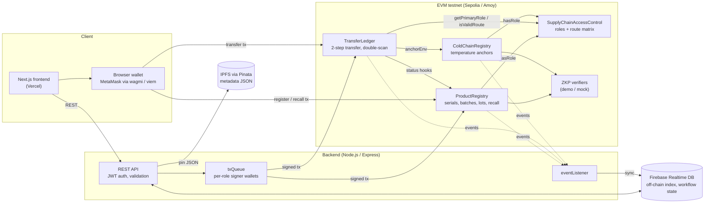

# VaxiTrust — Vaccine Traceability on Blockchain

**🏆 Top 10 – Incubation Track, ATTACKER 2026: "ARE YOU AN INNOVATOR? WE'RE YOUR INVESTORS"**

[](https://github.com/thienanpham160806-code/vaccine-traceability-blockchain/actions/workflows/ci.yml)

VaxiTrust tracks vaccines from manufacturer or importer through distributors
to clinics and pharmacies. Every hand-over is a two-step, role-checked
transfer on an EVM chain. Recalls apply to a whole batch in one transaction,
and anyone can scan a QR code to check whether a vial is genuine, recalled or
already administered.

- **Context:** group course project for the Blockchain course at the
  University of Economics and Law (UEL), VNU-HCM.
- **Live demo:** https://vaccine-traceability-blockchain.vercel.app/login
- **Contracts:** deployed on Ethereum Sepolia (addresses in
  [`smart-contract/deployments/sepolia.json`](smart-contract/deployments/sepolia.json)).
  Hardhat, frontend and backend configs also support Polygon Amoy (chain id
  80002).

## Features

- **Product registration.** Register single serials (`registerProduct`), or a
  whole lot in one transaction as a Merkle root of salted unit hashes
  (`commissionLot`). Importers can register through a zero-knowledge proof
  path (`registerImportedProductZK`).
- **Two-step custody transfer.** The sender creates a request, and the
  receiver confirms at the declared location or rejects it. Role and route
  rules are enforced on-chain.
- **Double-scan detection.** If a serial is scanned at a different location
  within 30 minutes, the contract emits `DoubleScanDetected`.
- **Batch and lot recall.** One transaction recalls a batch, whatever its
  size. Recalled products cannot be transferred or confirmed.
- **Lot splitting and dispensing.** Lots can be split into sub-lots. Each
  dose is decommissioned with a Merkle proof when administered.
- **Cold-chain anchoring.** Temperature readings for each custody leg are
  committed as a Merkle root plus a compliance flag.
- **Verification.** A full internal view for supply-chain staff, and a public
  consumer page (`/consumer/verify/[serialId]`) that shows validity, recall
  and risk warnings, and a simplified timeline.
- **Operations.** Role requests and approval, risk flags, disputes with
  evidence, import-document approvals, reconciliation between chain and
  database, and an English/Vietnamese UI.

## Architecture



**What is stored where.** On-chain storage holds only hashes and state:
serial, batch, lot and metadata hashes, salted actor and location hashes,
owner, status and Merkle roots. Readable product data lives in IPFS (metadata
JSON pinned through Pinata) and Firebase (index, workflow state, users). The
chain is the tamper-evident record those hashes are checked against.
Predictable identifiers are hashed with a salt (`CryptoUtils.hashWithSalt`),
so nobody can reverse them by enumerating possible values.

**Two ways to write.** Most writes go through the backend, which queues them
and signs with the key for the acting role. Some screens (register, transfer,
confirm/reject, recall) can sign directly with the user's wallet instead, and
then call a `sync-wallet-*` endpoint so Firebase stays in step.

## Quality metrics

All numbers below come from running the tools on this repository; the
commands are listed under each table. CI
([`.github/workflows/ci.yml`](.github/workflows/ci.yml)) compiles and tests the
contracts, runs coverage, and builds and tests the backend and frontend on
every push and pull request.

### Test coverage

`solidity-coverage` 0.8.17, 146 Hardhat tests (88 before this pass).

| Contract | Statements | Branches | Functions | Lines |
|---|---|---|---|---|
| SupplyChainAccessControl | 100% | 100% (was 80.36%) | 100% | 100% |
| ProductRegistry | 100% (was 71.62%) | 99.56% (was 49.12%) | 100% (was 83.33%) | 100% (was 70.88%) |
| TransferLedger | 100% (was 83.08%) | 94.29% (was 55.71%) | 100% (was 84.62%) | 100% (was 83.78%) |
| ColdChainRegistry | 100% | 100% (was 81.25%) | 100% | 100% |
| **All contracts** | **100%** (was 79.18%) | **98.70%** (was 57.55%) | **100%** (was 86.96%) | **100%** (was 78.88%) |

The 5 uncovered branches cannot be reached through the deployed wiring:
`TransferLedger` re-checks `FLAGGED` / `IN_TRANSIT` after guards that already
exclude them (4 branches), and `ProductRegistry._isRecalled` tests a stored
`RECALLED` status that is never written, because recall is computed from the
batch flag (1 branch).

New suites cover the paths that matter most: role revoke and primary-role
switch, every rejection in the two-step transfer, `rejectTransfer`,
double-scan detection (window and location rules), recall while a transfer is
in flight, flag/unflag, and the ZK import registration path.

```bash
cd smart-contract && npm run coverage
```

### Gas

`hardhat-gas-reporter` 2.3.0 on the Hardhat network; solc 0.8.28, `viaIR`,
optimizer `runs: 1`. Values are gas units; cost in ETH = gas × gas price.

| Function | Min | Max | Avg | Notes |
|---|---|---|---|---|
| `ProductRegistry.registerProduct` | 235,066 | 272,780 | 249,525 | Benchmark: 252,154 for the first serial of a batch, 235,054 for the next. Max is the importer path, which also stores `importDocHash` |
| `TransferLedger.createTransferRequest` | 276,409 | 313,285 | 298,621 | First hop writes fresh `lastScans` slots |
| `TransferLedger.confirmTransfer` | 266,403 | 283,503 | 280,394 | Appends a `TransferRecord`, clears the pending entry |
| `TransferLedger.rejectTransfer` | 70,321 | 70,331 | 70,325 | |
| `ProductRegistry.recallBatch` | – | – | 79,846 | Same cost for any batch size (below) |
| `ProductRegistry.commissionLot` | 149,342 | 149,390 | 149,377 | Registers a whole lot as one Merkle root |

**`recallBatch` is O(1) in batch size.** It sets one flag
(`recalledBatches[batchHash]`) and stores the reason; it does not loop over
serials. Every read (`getStatus`, `getProduct`, `getRiskLevel`) checks that
flag, so each serial in the batch reads as `RECALLED` straight away. Measured
with [`scripts/gas-benchmark.ts`](smart-contract/scripts/gas-benchmark.ts):

| Batch size | `recallBatch` gasUsed | `getBatchSerials` (`eth_call` gas) |
|---|---|---|
| 1 | 79,846 | 27,553 |
| 10 | 79,846 | 47,993 |
| 100 | 79,846 | 252,465 |
| 500 | 79,834 | 1,162,750 |

The part that grows with batch size is the read-only `getBatchSerials`, at
about 2,275 gas per serial. Nothing calls it on-chain, so it cannot block a
recall. An RPC node with geth's default 50M `eth_call` gas cap could return
about 21,900 serials in one call (extrapolated from the slope above, not
measured); larger batches would need paging.

```bash
cd smart-contract && npm run test:gas        # per-method table
cd smart-contract && npm run gas:benchmark   # lifecycle + batch-size scaling
```

### Security (Slither + manual review)

Slither 0.11.6, 102 detectors. Full write-up:
[`docs/security-review.md`](docs/security-review.md).

| | High | Medium | Low | Info | Optimization |
|---|---|---|---|---|---|
| Slither results (37) | 0 | 4 (all false positives) | 23 (22 false positives, 1 accepted) | 5 (style) | 5 (valid, measured, not applied) |
| Manual review (11) | 1 | 2 | 4 | 4 | – |

- **Fixed in a separate PR** (`fix/contract-access-control`, with regression
  tests): **H-1** the TransferLedger lot functions had no caller check, so any
  address could mark any vial as dispensed; **M-1** a recalled lot could still
  be dispensed through a sub-lot; **M-2** revoking a role via OpenZeppelin's
  `revokeRole` / `renounceRole` left the account able to transfer. The
  contracts were redeployed to Sepolia from that branch on 2026-10-06, and the
  fix was confirmed on-chain: an address without a role is refused by all
  three new checks.
- The Slither Medium results (`reentrancy-no-eth`, `incorrect-equality`) are
  false positives: the only external callee is the project's own
  `ProductRegistry`, which makes no callbacks, and the equality compares
  `bytes32` hashes.

## Smart contracts

| Contract | Responsibility |
|---|---|
| `SupplyChainAccessControl` | OpenZeppelin `AccessControl` with 7 roles, a primary role per account, and the sender → receiver route matrix |
| `ProductRegistry` | Serials, batches, lots and sub-lots, product status and owner, recall, flag/unflag, unit decommissioning (Merkle proof) |
| `TransferLedger` | Two-step transfer, transfer history, double-scan detection; the only contract allowed to change product status, owner and lot custody in `ProductRegistry` |
| `ColdChainRegistry` | Cold-chain environment anchors for each lot leg; written only through `TransferLedger` |
| `DemoImportZKPVerifier`, `MockColdChainVerifier` | Placeholder verifiers with the real verifier interfaces (see [Limitations](#known-limitations)) |

### Roles

| Role | Holder |
|---|---|
| `DEFAULT_ADMIN_ROLE` | System admin: grants roles, configures routes and contract wiring |
| `MANUFACTURER_ROLE` | Vaccine manufacturer |
| `IMPORTER_ROLE` | Vaccine importer |
| `DISTRIBUTOR_ROLE` | Distributor or intermediate warehouse |
| `CLINIC_ROLE` | Clinic or vaccination point |
| `PHARMACY_ROLE` | Pharmacy |
| `AUDITOR_ROLE` | Auditor / dispute reviewer (not part of physical transfers) |
| `RECALL_AUTHORITY_ROLE` | Authority that recalls batches and lots and clears flags |

### Route matrix

`configureMvpRoutes()` sets up the following matrix; admins can change any
route with `setRoute`.

| From → To | Allowed |
|---|---|
| Manufacturer → Distributor | ✅ |
| Importer → Distributor | ✅ |
| Distributor → Clinic | ✅ |
| Distributor → Pharmacy | ✅ |
| Manufacturer → Importer | ❌ (disabled) |
| Distributor → Distributor | ❌ (disabled) |

Only manufacturers, importers and distributors can send. Only importers,
distributors, clinics and pharmacies can receive.

### Product status

| On-chain status | Meaning |
|---|---|
| `VERIFIED` | Registered and owned by its origin (new products start here) |
| `IN_TRANSIT` | A transfer request is pending; the UI shows "Pending delivery" |
| `DELIVERED` | The receiver confirmed the transfer; the UI also shows the receiver type (distributor / clinic / pharmacy) |
| `FLAGGED` | Marked as risky; cleared by the recall authority with `unflagProduct` |
| `RECALLED` | The batch was recalled. Derived from the batch flag at read time, so it applies to every serial at once |

"Administered" is tracked per unit through `decommissionUnit` /
`unitDecommissioned`, not through the status enum.

### Main flows

1. **Register.** `ProductRegistry.registerProduct(serial, batch, metadata, importDoc, proof)`
   for a single serial, or `commissionLot(lotId, merkleRoot, metadata, proof, ts)`
   for a whole lot.
2. **Transfer.** `TransferLedger.createTransferRequest(serial, receiver, fromLoc, toLoc)`
   checks owner, roles, route, recall/flag state and pending requests, and runs
   the double-scan check. Then `confirmTransfer(serial, receiverLoc)` changes
   the owner and appends history, or `rejectTransfer(serial, reason)` reverts
   the product's status. Lot custody hand-overs are recorded with
   `recordEvent`, and lots are split with `disaggregate`.
3. **Recall.** `ProductRegistry.recallBatch(batch, reasonHash)` or
   `recallLot(lotId, reasonHash)`.
4. **Dispense.** `TransferLedger.decommissionUnit(unit, lot, merkleProof, eventType, ts)`.
5. **Verify.** `getProduct`, `getStatus`, `getRiskLevel`, `getFlagReason`,
   `getTransferHistory`, `lotExists`, `unitDecommissioned`.

More detail: [`docs/contract-flow-map.md`](docs/contract-flow-map.md),
[`docs/transfer-recall-logic.md`](docs/transfer-recall-logic.md),
[`docs/route-matrix.md`](docs/route-matrix.md),
[`smart-contract/docs/transfer-ledger.md`](smart-contract/docs/transfer-ledger.md).


## Tech stack

| Layer | Technologies |
|---|---|
| Smart contracts | Solidity 0.8.28, Hardhat 2, OpenZeppelin Contracts 5, TypeScript, ethers v6, Circom + snarkjs (import-registration circuit) |
| Backend | Node.js, Express 4, TypeScript, ethers v6, Firebase Admin (Realtime Database), Pinata (IPFS), JWT + wallet-signature login, Joi / Zod validation, Helmet, Jest + Supertest |
| Frontend | Next.js 16 (App Router), React 19, TypeScript, Tailwind CSS 4, shadcn/ui (Radix), TanStack Query, wagmi + viem (MetaMask), sonner, qrcode.react |
| Tooling | solidity-coverage, hardhat-gas-reporter, Slither, GitHub Actions |
| Hosting | Vercel (frontend), Railway or Render (backend), Ethereum Sepolia / Polygon Amoy (contracts), Firebase |

## Repository structure

```text
smart-contract/
  contracts/        Solidity sources (+ interfaces/, verifiers/)
  test/             Hardhat test suites (146 tests)
  scripts/          deploy, sync-abis, configure-routes, grant-role, gas-benchmark
  circuits/         Circom circuit for importer ZK registration
  deployments/      Deployed addresses per network
  abis/             ABIs exported for backend/frontend
backend/
  src/routes/       REST endpoints (auth, products, transfers, verify, coldchain, ops, ...)
  src/services/     txQueue, eventListener, merkle, lotSync, riskEngine, ipfs, coldchainSim, ...
  src/contracts/    Contract client + ABIs
  scripts/          Seed, reconcile, cold-chain simulation, E2E smoke test
  tests/            Jest unit tests
frontend/
  src/app/          Next.js routes (dashboard, consumer verify, login)
  src/components/   UI, layout, product and trace components
  src/lib/          API client, auth, i18n, wallet contract calls
docs/               Design notes, deployment guides, security review
```

## Getting started (local)

Requirements: Node.js 20+ (CI uses 24) and npm. The backend also needs a
Firebase project and, optionally, a Pinata JWT.

**1. Contracts (local chain)**

```bash
cd smart-contract
npm install
npx hardhat node            # terminal 1: local chain on http://127.0.0.1:8545
npm run deploy:local        # terminal 2: deploy, configure routes, grant demo roles, sync ABIs
```

`deploy:local` grants demo roles to the Hardhat accounts (0 manufacturer +
recall authority, 1 importer, 2 distributor, 3 clinic, 4 pharmacy) and writes
addresses to `deployments/localhost.json`.

**2. Backend**

```bash
cd backend
npm install
cp .env.example .env        # then fill it in (see below)
npm run dev                 # http://localhost:5000
npm run seed:demo           # optional: demo data in Firebase
```

**3. Frontend**

```bash
cd frontend
npm install
cp .env.local.example .env.local
npm run dev                 # http://localhost:3000
```

**Checks**

```bash
cd smart-contract && npm test && npm run coverage
cd backend && npm run build && npm test
cd frontend && npm run build
```

### Environment variables

Templates: `smart-contract/.env.example`, `backend/.env.example` and
`frontend/.env.local.example`. Never commit real `.env` files, and only use
test wallets.

| File | Variables |
|---|---|
| `smart-contract/.env` | `SEPOLIA_RPC_URL`, `AMOY_RPC_URL`, `PRIVATE_KEY` (deployer), `ETHERSCAN_API_KEY`, `POLYGONSCAN_API_KEY` |
| `backend/.env` | `BLOCKCHAIN_RPC_URL` (`http://127.0.0.1:8545` locally); `BACKEND_PRIVATE_KEY`, `ADMIN_` / `MANUFACTURER_` / `IMPORTER_` / `DISTRIBUTOR_` / `CLINIC_` / `PHARMACY_` / `RECALL_AUTHORITY_PRIVATE_KEY`; `PRODUCT_REGISTRY_ADDRESS`, `TRANSFER_LEDGER_ADDRESS`, `ACCESS_CONTROL_ADDRESS`, `COLD_CHAIN_REGISTRY_ADDRESS`; `SYSTEM_SALT`; `PINATA_JWT`; `FIREBASE_*`; `JWT_SECRET`; `PORT` (default 5000) |
| `frontend/.env.local` | `NEXT_PUBLIC_API_URL` (`http://localhost:5000` locally), `NEXT_PUBLIC_CONSUMER_VERIFY_BASE_URL`, `NEXT_PUBLIC_USE_AMOY` (leave unset or `false`: Sepolia is the default), `NEXT_PUBLIC_ENABLE_LOCAL_CHAIN`, `NEXT_PUBLIC_SEPOLIA_RPC_URL`, `NEXT_PUBLIC_AMOY_RPC_URL`, `NEXT_PUBLIC_PRODUCT_REGISTRY_ADDRESS`, `NEXT_PUBLIC_TRANSFER_LEDGER_ADDRESS`, `NEXT_PUBLIC_IPFS_GATEWAY_URL` |

## Deployment

| Part | How |
|---|---|
| Contracts | `npm run deploy:sepolia` (or `npx hardhat run scripts/deploy.ts --network amoy`). Writes `deployments/<network>.json` and syncs ABIs |
| Backend | Railway (`railway.json`, `backend/nixpacks.toml`) or Render ([`docs/deploy-backend-render.md`](docs/deploy-backend-render.md)) |
| Frontend | Vercel, project root `frontend/` ([`docs/deploy-frontend-vercel.md`](docs/deploy-frontend-vercel.md)) |
| Firebase rules | `database.rules.json`, deployed with `cd backend && npm run deploy:rules` ([`docs/firebase-rules-audit.md`](docs/firebase-rules-audit.md)) |

## Backend API overview

| Prefix | Main endpoints |
|---|---|
| `/auth` | `POST /nonce`, `POST /login-with-signature`, `POST /login` (demo), `GET /me`, `GET /session`, `POST /logout`, role requests (`POST/GET /role-requests`, approve / reject) |
| `/products` | `GET /`, `GET /:serialId`, `GET /:serialId/detail`, `POST /register` (lot commissioning), `POST /bulk`, `POST /sync-wallet-register`, `POST /:serialId/administer`, `POST /:serialId/unflag` |
| `/batches` | `GET /`, `GET /:batchId`, `GET /:batchId/serials` |
| `/transfers` | `POST /scan`, `/lot-scan`, `/bulk-scan`, `/confirm`, `/reject`, `/:transferId/confirm-lot`, `/:transferId/reject-lot`, `sync-wallet-*`, `GET /`, `GET /:transferId` |
| `/verify` | `GET /:serialId` (internal), `GET /consumer/:serialId` (public), `POST /:serialId/dispense` |
| `/coldchain` | `POST /readings`, `GET /legs`, `GET /legs/:legId`, `POST /legs/:legId/seal` |
| `/disaggregate` | `POST /` (split a lot), `GET /:lotId/sub-lots` |
| `/import-zkp` | `POST /approvals`, `GET /approvals` |
| `/` (ops) | `GET/POST /recalls`, `POST /recalls/lot`, `/risk-flags`, `/disputes`, `/admin/reconcile/*`, `/admin/route-diagnostics`, `/admin/archived` |
| `/dashboard` | `GET /overview`, `GET /recent-activity` |
| `/health` | Health check |

## Frontend routes

| Route | Purpose |
|---|---|
| `/`, `/login` | Landing page; login with a MetaMask signature or as a demo actor |
| `/dashboard` | Role-aware overview |
| `/dashboard/products`, `/register`, `/bulk`, `/batches`, `/import-approvals` | Register and browse products, lots and batches |
| `/dashboard/transfers`, `/create`, `/scan`, `/history`, `/[transferId]` | Two-step transfers |
| `/dashboard/scan`, `/dashboard/scan-transfer` | Scan a serial or lot QR code |
| `/dashboard/verify/[serialId]` | Full internal verification and timeline |
| `/dashboard/recall` | Batch and lot recall |
| `/dashboard/coldchain`, `/[legId]` | Cold-chain legs and readings |
| `/dashboard/risk-flags`, `/disputes`, `/risk-dispute` | Risk and dispute handling |
| `/dashboard/admin/roles`, `/admin/archived`, `/role-request`, `/profile` | Role administration and account |
| `/consumer/verify/[serialId]` | Public consumer verification (no login) |

## Known limitations

- **ZKP verifiers are placeholders.** `DemoImportZKPVerifier` and
  `MockColdChainVerifier` only check that inputs are well-formed, and the
  mock proof check in `registerProduct` / `commissionLot` accepts any
  non-empty proof. The Groth16 circuit (`circuits/import_registration.circom`)
  exists, but its verifier is not deployed.
- **Nothing is deployed on Polygon Amoy yet.** The configs support it, but
  the only live deployment is on Sepolia.
- **Double-scan alerts are on-chain only.** The backend does not yet
  subscribe to `DoubleScanDetected`.
- **Single admin key.** A multisig or timelock is recommended outside demos.
- **Stuck transfers.** Only the receiver can clear a pending transfer;
  a sender-side timeout is not implemented.

See [`docs/security-review.md`](docs/security-review.md) for the full list.

## Team & roles

<!-- Fill in one row per member. -->

| Member | Role | Main contributions | GitHub |
|---|---|---|---|
|  |  |  |  |
|  |  |  |  |
|  |  |  |  |
|  |  |  |  |
|  |  |  |  |

## Further documentation

- Team handoff and local setup details: [`docs/frontend-backend-handoff.md`](docs/frontend-backend-handoff.md)
- Contract design: [`docs/smart-contract-handoff.md`](docs/smart-contract-handoff.md), [`docs/product-registry.md`](docs/product-registry.md)
- Interview prep (Vietnamese): [`INTERVIEW_NOTES.md`](INTERVIEW_NOTES.md)

## Contributing

Work on a `feature/...`, `fix/...`, `docs/...` or `chore/...` branch and open
a pull request into `main`; do not push to `main` directly. CI must pass
before merging. Keep contract, backend, frontend and docs changes in
separate PRs where possible.
